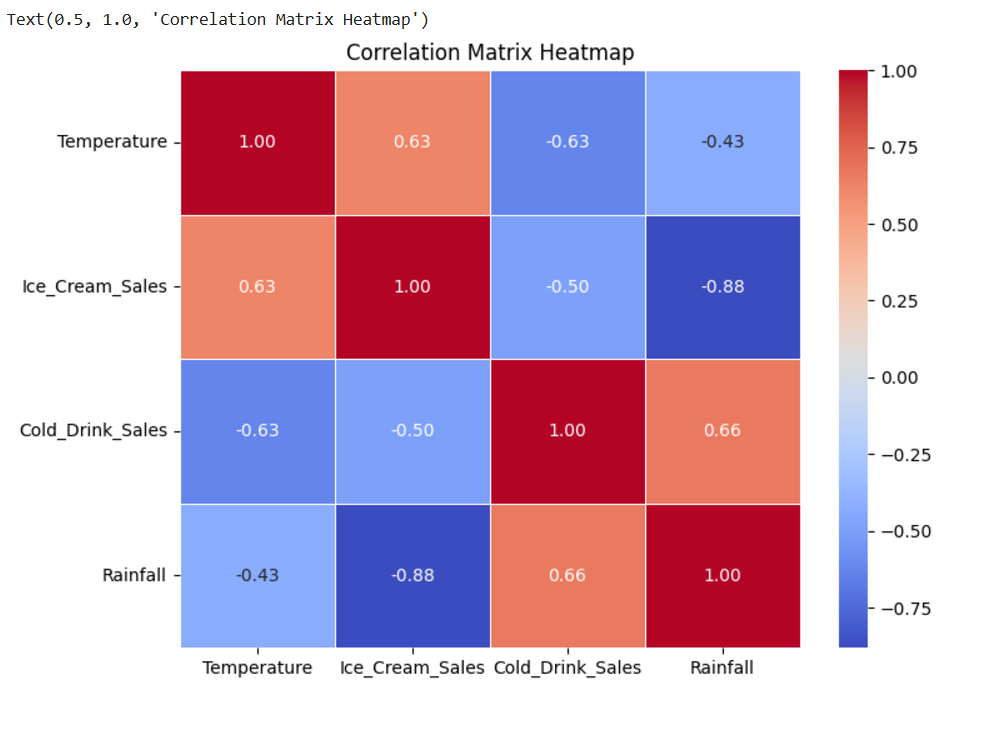

```{r setup, include=FALSE}
# Configuración global de chunks
knitr::opts_chunk$set(
  echo = FALSE,        # Mostrar código
  warning = FALSE,    # Ocultar advertencias
  message = FALSE,    # Ocultar mensajes de carga
  fig.align = "center",
  out.width = "0.9\\linewidth",
  fig.pos = "H",
  crop = FALSE
)

# Cargar librerías necesarias
library(tidyverse)
library(knitr)
library(kableExtra)
library(scales)
```

\newpage
\markboth{INTRODUCCIÓN}{INTRODUCCIÓN}
\addcontentsline{toc}{chapter}{Introducción}
\vspace*{1cm}

\chapter{Planteamiento del Problema}

En la actualidad, el sector minorista (retail) se enfrenta a un entorno altamente competitivo donde la comprensión del cliente es vital. Tal como lo señala la firma de análisis NIQ y GfK (2024) en su \textit{Estudio Retail 2024-2025}: \`\`las tendencias actuales subrayan la importancia de adaptar las estrategias de venta a los perfiles generacionales [...] evidenciando una fuerte correlación entre las poblaciones y su interés comercial\`\`. Las dinámicas de consumo y la frecuencia de compra están directamente vinculadas a la segmentación generacional y el perfil del comprador, obligando a las marcas a estudiar sus datos demográficos para anticiparse al comportamiento del mercado. Las empresas ya no solo venden productos sino que gestionan información estratégica para optimizar su inventario y fidelizar a sus consumidores.A partir de esta realidad, surge la necesidad de aplicar este mismo enfoque analítico a nivel micro. Al disponer de un conjunto de datos transaccionales del año 2023 de una tienda *retail*, existe la oportunidad de extraer información valiosa que describa quiénes son los clientes y cómo interactúan con los productos ofrecidos. El problema central radica en transformar estos datos crudos en información estructurada que permita comprender las dinámicas básicas de consumo sin recurrir a modelos predictivos complejos, basándose estrictamente en el comportamiento histórico registrado.

El problema central de esta investigación radica en determinar: ¿Existe una asociación observable entre el perfil demográfico del consumidor y sus hábitos de gasto y elección de productos en el conjunto de datos de 2023?

Debido a esto, se plantea las siguientes preguntas de investigación:\

\textbf{1.} ¿Cuál es el perfil demográfico de los clientes que conforman el conjunto de datos de 2023 y cómo se distribuyen gráficamente según su edad y género?

\textbf{2.} ¿Cómo fluctúa el comportamiento de las ventas y el gasto promedio mensual a lo largo del año?

\textbf{3.} ¿Cuáles son las preferencias de compra en las distintas categorías de productos según los diferentes grupos etarios de los consumidores?\

\section{Justificación}

La presente investigación se justifica desde un punto de vista práctico y académico. En el ámbito práctico, el análisis descriptivo de bases de datos de clientes permite a cualquier negocio identificar a su público objetivo real y observar hechos concretos, como qué productos tienen mayor salida en ciertos meses o qué rango de edad consume más tecnología frente a artículos de hogar. Esta información es la piedra angular para cualquier toma de decisiones comerciales, diseño de campañas o gestión de inventario. Desde el punto de vista académico, este trabajo representa una aplicación directa y rigurosa de los fundamentos de estadística descriptiva y computación del primer semestre. Permite demostrar el dominio en la limpieza de datos, el uso de tablas de frecuencia, la visualización de datos (como la construcción de pirámides poblacionales) y el análisis de correlación simple. Al limitar el estudio a herramientas descriptivas, se garantiza un manejo profundo y preciso de los resultados obtenidos, sentando las bases analíticas necesarias para futuras investigaciones más complejas.\

\section{Objetivos}

\subsection{Objetivo General}
\begin{itemize}
  \item{Analizar el perfil demográfico y el comportamiento de compra de los clientes registrados en el conjunto de datos de retail durante el año 2023, utilizando técnicas de estadística descriptiva para la identificación de patrones de consumo.}
\end{itemize}
\subsection{Objetivos Específicos}
\begin{itemize}
  \item{Describir la estructura demográfica de los consumidores mediante la elaboración de una pirámide poblacional que clasifique a los clientes por edad y género.}
  \item{Identificar el grado de asociación lineal entre las variables cuantitativas del estudio como edad, ingresos y monto de gasto a través del cálculo de una matriz de correlación.}
  \item{Describir la fluctuación de las ventas a lo largo del año 2023 para identificar los picos de demanda y el comportamiento regular en periodos particulares.}
  \item{Determinar las preferencias de compra por categoría de producto según distintos rangos de edad, utilizando tablas de frecuencia cruzada (tablas de contingencia).}
\end{itemize}

\section{Cobertura}

\subsection{Horizontal}

La cobertura horizontal abarca las características intrínsecas de cada cliente y transacción registrada en la base de datos de *retail*. Se consideran las dimensiones demográficas de los consumidores (como edad y género) y las métricas descriptivas de su comportamiento de consumo (categorías de productos y monto de gasto) dentro del mercado estudiado.

\subsection{Vertical}

La cobertura vertical del trabajo de investigación comprende un total de **1,000 observaciones** (registros). Cada fila representa una transacción única realizada por un cliente. El alcance temporal de los datos se circunscribe al año 2023, lo que permite un análisis transversal y descriptivo del comportamiento de ventas en dicho periodo.

\begin{table}[ht]
\centering
\caption{Variables consideradas}
\resizebox{10cm}{!}{
\begin{tabular}{ccc}
\hline
TIPO & VARIABLE & DESCRIPCIÓN \\
\hline
Categórica & Género & Identidad de género del cliente registrado \\
Numérica & Edad & Edad del consumidor expresada en años \\
Categórica & Categoría\_Producto & Clasificación del artículo adquirido (ej. Tecnología, Hogar, Vestimenta) \\
Numérica & Gasto\_Total & Monto monetario total gastado en la transacción \\
Fecha/Numérica & Fecha\_Compra & Día, mes y año exacto de la transacción durante el periodo 2023 \\
\hline
\end{tabular}
}
\end{table}

\section{Periodo de Referencia}

Periodo de Referencia "El análisis se basa en datos históricos recolectados durante el año fiscal 2023, permitiendo observar el comportamiento del consumidor a lo largo de los doce meses de dicho periodo."

\section{Variables}

La variable principal de interés económico en este estudio es el **Gasto_Total** (o *Total_Sales*), que representa el volumen monetario de las transacciones realizadas por los clientes. Como variables descriptivas y de segmentación se analizan:

1.  Variables Demográficas: **Edad y Género.**

2.  Variables Comerciales: **Categoría_Producto.**

3.  Variables Temporales: **Fecha_Compra.**

\chapter{Marco Teórico}

En el presente capítulo se exponen los fundamentos teóricos y metodológicos que sustentan el desarrollo de esta investigación. Dado que el objetivo central del proyecto es comprender la asociación entre los factores demográficos y los patrones de consumo en el sector minorista durante el año 2023, resulta indispensable establecer un marco de referencia claro. A continuación, se definen las herramientas de la estadística descriptiva y las técnicas de visualización de datos empleadas, las cuales permiten transformar los registros transaccionales crudos en información estratégica para la toma de decisiones, garantizando así la validez y el rigor analítico de los resultados obtenidos.

\section{Bases Teóricas}

Para sustentar el análisis del comportamiento de consumo en el sector retail durante el año 2023, la presente investigación se fundamenta en los siguientes conceptos estadísticos y analíticos:

\subsection{Definición Retail}

El término retail, o comercio minorista, hace referencia al sector económico que engloba a las empresas especializadas en la venta masiva de productos o servicios a múltiples clientes finales. Kotler y Keller (2012) lo definen como "todas las actividades que intervienen en la venta de bienes o servicios directamente a los consumidores finales para su uso personal y no comercial". Este sector se caracteriza por un alto volumen de transacciones y la necesidad constante de analizar los patrones de compra para optimizar el inventario.

\subsection{Análisis Exploratorio de Datos (EDA)}

El Análisis Exploratorio de Datos es un enfoque metodológico inicial en el análisis estadístico que tiene como objetivo resumir las características principales de un conjunto de datos, frecuentemente utilizando métodos visuales. En el contexto de las ventas minoristas, el EDA permite descubrir patrones de consumo, identificar anomalías y establecer la relación básica entre el perfil demográfico del cliente y su volumen de compra, sin la necesidad de formular modelos predictivos complejos desde el inicio.

\subsection{Estadistica Descriptiva}

Es la rama de la estadística encargada de recolectar, analizar y presentar los datos de manera estructurada y comprensible. Para este proyecto, se emplean medidas de tendencia central (como el promedio de edad) y medidas de frecuencia (como el conteo de transacciones totales) para resumir el comportamiento macro de la tienda en 2023.

\subsection{Pirámide Poblacional}

Es una representación gráfica, típicamente estructurada como un histograma bidireccional, que muestra la distribución de una población según grupos de edad y género. En el ámbito del retail, esta herramienta visual permite segmentar el mercado e identificar rápidamente qué segmento demográfico representa la mayor fuerza compradora del negocio, facilitando la toma de decisiones sobre inventario y marketing.

```{r, fig.align='center', out.width="0.5\\linewidth"}
knitr::include_graphics("Imagenes/piramide.png.png")
```

\begin{center}
\small \textit{Figura 1, fuente: elaboración propia a partir de referencias web.}
\end{center}

\subsection{Matriz de Correlación}

Es una tabla matemática que muestra los coeficientes de correlación entre diferentes variables numéricas. Su función principal es medir el grado de asociación lineal entre dos métricas (por ejemplo, la edad de un cliente y el monto total gastado). Los valores oscilan entre -1 y 1, donde valores cercanos a 1 indican una fuerte relación positiva, y los cercanos a 0 indican la ausencia de relación. Visualmente, se suele representar mediante un mapa de calor (Heatmap) para facilitar su interpretación.

```{r, fig.align='center', out.width="0.5\\linewidth"}

```

\begin{center}
\small \textit{Figura 2, fuente: elaboración propia a partir de referencias web.}
\end{center}

\subsection{Análisis de Series de Tiempo Simples}

Se refiere al estudio de las variaciones o fluctuaciones periódicas en los datos a lo largo de un ciclo temporal específico (en este caso, los doce meses del año). Utilizando gráficos de líneas, se busca identificar picos de demanda y valles de ventas, lo cual es fundamental en el comercio minorista para planificar la reposición de mercancía en temporadas altas.

\subsection{Tablas de Contingencia y Gráficos de Barras Apiladas}

Una tabla de contingencia es una herramienta que tabula la frecuencia de observaciones de múltiples variables categóricas. Gráficamente, esto se traduce en gráficos de barras apiladas, los cuales permiten observar la proporción que ocupa cada subcategoría (por ejemplo, el tipo de producto) dentro de un grupo mayor (los rangos de edad). Esta técnica es ideal para responder interrogantes sobre preferencias de productos específicas por segmento etario.

\chapter{Marco Metódico}

En este capítulo se describen los procedimientos, técnicas y herramientas tecnológicas empleadas para llevar a cabo el Análisis Exploratorio de Datos (EDA) sobre los registros de ventas del sector minorista correspondientes al año 2023. Se detalla el tratamiento aplicado a la base de datos y la justificación de los recursos computacionales utilizados.

\section{Bases metódicas utilizadas en el trabajo de investigación}

\subsection{Origen y Tratamiento de los Datos}

La presente investigación se enmarca en un diseño no experimental de corte transversal (analizando un periodo específico del año 2023). Es de tipo descriptiva y cuantitativa, ya que busca especificar las propiedades y características demográficas de los consumidores mediante el análisis estadístico de sus compras. El conjunto de datos transaccionales fue extraído de un repositorio público validado en la plataforma de ciencia de datos Kaggle. Dicho conjunto fue sometido a procesos de limpieza (Data Wrangling) para asegurar la consistencia de las variables de edad, género, categorías y montos de compra. Destacando las siguientes operaciones metodológicas:

\begin{itemize}
\item{Transformación temporal: Se convirtió la variable de la fecha de compra a un formato estandarizado de series de tiempo (Datetime) para poder aislar y agrupar los datos según su ocurrencia mensual para el análisis de la serie temporal dentro del periodo establecido (1 año).}

\item{Discretización de variables (Binning): Para la creación de la pirámide poblacional, se transformó la variable continua "Edad" en una variable categórica ("Rango Edad"). Se agruparon a los clientes en cinco intervalos específicos (<25, 26-35, 36-45, 46-55, 56+), lo que permitió cruzar esta información demográfica con las preferencias de categorías de productos.}
\end{itemize}

\subsection{Herramientas y Lenguajes de Programación}

Para la ejecución de este marco metodológico, se seleccionó el lenguaje de programación Python, reconocido por su robustez en la ciencia de datos. El procesamiento se llevó a cabo mediante la integración de las siguientes librerías especializadas:

\begin{itemize}
\item{Pandas: Utilizada como la estructura principal para la manipulación de datos. Mediante esta librería se ejecutaron las funciones de agrupación poblacional y el cálculo matemático de la matriz de correlación de Pearson/Spearman para evaluar la relación entre la edad y el monto de compra.}

\item{Plotly Express: Herramienta seleccionada para la visualización gráfica de los datos. Su implementación metodológica permitió construir representaciones bidireccionales (para el contraste de géneros) y mapas de calor (Heatmaps), superando las limitaciones de los gráficos estáticos tradicionales.}

\item{Streamlit: Framework empleado para estructurar lógicamente los resultados en un panel de control interactivo (Dashboard), facilitando la segmentación visual de los objetivos demográficos y de consumo a través de pestañas dinámicas. Adicionalmente, se implementaron componentes de interfaz de usuario (Widgets), específicamente un control deslizante (Slider), que permite filtrar la base de datos en tiempo real según rangos de edad personalizados, garantizando una exploración analítica profunda y focalizada.}
\end{itemize}

\chapter{Análisis de Resultados}

Este capítulo presenta los resultados obtenidos al aplicar las metodologías descritas en el capítulo anterior, enfocándose en el análisis estadístico descriptivo de las variables transaccionales y demográficas del año 2023 a través del panel interactivo.

\section{Ventajas y Desventajas de los Tests Aplicados}

Antes de detallar los hallazgos visuales, es metodológicamente pertinente evaluar el alcance de las herramientas estadísticas empleadas en este Análisis Exploratorio de Datos (EDA):

\subsection{Matriz de Correlación:}
\begin{itemize}
\item{Ventajas: Permite identificar visual y numéricamente la fuerza y dirección de la relación lineal entre múltiples variables numéricas (por ejemplo, contrastar si la Edad afecta el Total Gastado).}

\item{Desventajas: Mide únicamente asociación matemática, no causalidad. Adicionalmente, el test clásico de Pearson puede ser sensible a valores atípicos (outliers) que distorsionen el coeficiente.}
\end{itemize}
\subsection{Discretización Demográfica:}
\begin{itemize}
\item{Ventajas: Transformar la variable continua Edad en rangos categóricos facilita enormemente la interpretación visual y la detección de patrones macro en el comportamiento de consumo por generaciones.}

\item{Desventajas: Al agrupar los datos se pierde la varianza interna y la granularidad de la variable original, asumiendo que un cliente de 26 años se comporta exactamente igual que uno de 35 por pertenecer al mismo segmento.}
\end{itemize}

```{r}

df <- read.csv("Dataset.limpio/retail_limpio.csv")
df$Date <- as.Date(df$Date)
df$Rango_Edad <- cut(df$Age, breaks=c(0,25,35,45,55,100), labels=c("<25","26-35","36-45","46-55","56+"))
```

\section{Estadistica descriptiva por categoria}

```{r}
df %>%
group_by(Categoria = Product.Category) %>%
summarise(Transacciones = n(), Edad_Promedio = round (mean(Age), 1),  Gasto_Promedio = round(mean(Total.Amount), 2), Desv_Estandar = round(sd(Total.Amount), 2), Ingreso_Total = sum(Total.Amount))%>%
kable(format = "latex", booktabs = TRUE, caption = "Estadísticas descriptivas de consumo por categoría")
```

Para comprender la composición demográfica de la base de clientes y determinar qué segmento representa la mayor fuerza compradora del negocio, se generó una pirámide poblacional a partir de los datos transaccionales. Como se observa en la siguiente figura, esta distribución visual permite contrastar claramente la participación de hombres y mujeres segmentados por sus respectivos rangos etarios durante el año 2023.

```{r}
df_pyramid <- df %>%
group_by(Rango_Edad, Gender) %>%
summarise(Count = n(), .groups = 'drop') %>%
mutate(Count = ifelse(Gender == "Male", -Count, Count))

ggplot(df_pyramid , aes(x = Rango_Edad, y = Count, fill = Gender)) +
geom_bar(stat = "identity") +
coord_flip() +
scale_y_continuous(labels = abs) +
theme_minimal() +
labs (x = "Rango de Edad", y = "Cantidad de Transacciones") +
scale_fill_manual(values = c("Female" = "#FF9999", "Male" = "#99CCFF"))
```

Al analizar la distribución de las transacciones, se hace evidente una reconfiguración del público objetivo. La mayor concentración de compras se agrupa sólidamente en el segmento de adultos de 46 a 55 años, con una participación equitativa entre hombres y mujeres (superando las 140 transacciones conjuntas). Por el contrario, se observa una marcada debilidad en la captación del segmento más joven (menores de 25 años), cuya participación es estadísticamente marginal. Esto sugiere que la oferta de valor de la tienda tiene alta resonancia en perfiles de mediana edad con poder adquisitivo consolidado.

\section{Correlación de Variables Numéricas}

Relación entre Edad y Monto Gastado. Para evaluar estadísticamente las dinámicas de compra y comprobar de manera empírica si el perfil demográfico determina el volumen de gasto, se procedió a generar un gráfico de dispersión bidimensional. Este método visual permite identificar si existe algún patrón de comportamiento, tendencia lineal o concentración de alto valor adquisitivo asociado a etapas de vida específicas, superando las limitaciones de la estadística descriptiva básica.

```{r}
cor(df$Age, df$Total.Amount, use = "complete.obs")
```

```{r}
ggplot(df, aes(x = Age, y = Total.Amount)) +
 
  geom_jitter(alpha = 0.6, color = "steelblue") +
    geom_smooth(method = "lm", color = "red", se = TRUE) +
  theme_minimal() +
  labs(
    x = "Edad del Cliente", 
    y = "Monto Total Gastado ($)",
    title = "Correlacion entre Edad y Gasto"
  )
```

El gráfico de dispersión confirma de manera empírica y visual la ausencia de una correlación lineal significativa entre las variables. La formación de bandas horizontales a lo largo del eje Y responde a la naturaleza discreta de los precios y cantidades en el sector retail; sin embargo, lo destacable es que estas agrupaciones de gasto se mantienen constantes a lo largo de todo el eje X (Edad). Las compras de alto valor (superiores a los \$1,500) son ejecutadas indistintamente por clientes de 20 años como de 60 años. Esto demuestra que la edad no es un factor predictivo del nivel de gasto y valida la recomendación de aplicar estrategias de upselling de forma transversal a toda la clientela.

\section{Evolución Temporal de los Ingresos (Serie de Tiempo Simple)}

El seguimiento temporal de las ventas es un componente vital del análisis exploratorio, ya que permite observar el comportamiento y la evolución del flujo de caja a lo largo de los doce meses del año 2023. El análisis de esta serie de tiempo simple resulta estratégico para identificar de manera empírica en qué momentos del año ocurren los picos de demanda y las caídas críticas, información fundamental para la futura optimización de inventarios.

```{r}
df_ts <- df %>% 
  mutate(Mes = month(Date, label = TRUE, abbr = TRUE)) %>% 
  group_by(Mes) %>% 
  summarise(Ingresos = sum(Total.Amount))

ggplot(df_ts, aes(x = Mes, y = Ingresos, group = 1)) + 
  geom_line(color = "steelblue", size = 1) + 
  geom_point(color = "darkblue", size = 2) + 
  theme_minimal() + 
  theme(axis.text.x = element_text(angle = 45, hjust = 1)) +
  labs(x = "Meses del Ano 2023", y = "Ingresos Totales ($)")
```

El análisis de la serie de tiempo simple, basado en el volumen de transacciones, revela una alta volatilidad en el flujo comercial durante el año 2023. En lugar de exhibir una tendencia estable, el comportamiento de compra fluctúa significativamente mes a mes. El pico máximo de actividad operativa se registró en mayo, superando la barrera de las 100 transacciones mensuales, seguido de repuntes importantes en el último trimestre (octubre y diciembre). Por el contrario, el mes de septiembre representó una contracción crítica en la afluencia, registrando el nivel más bajo del periodo (aproximadamente 65 transacciones). Este patrón irregular demuestra que el negocio opera bajo ciclos de demanda muy marcados, lo que exige estrategias ágiles: garantizar el máximo abastecimiento en mayo e implementar campañas agresivas para impulsar el tráfico de clientes durante la caída de septiembre.

\section{Preferencias de Categorías por Edad}

Finalmente, para trazar estrategias de marketing y abastecimiento mucho más precisas, es necesario cruzar la estructura demográfica con el comportamiento de compra específico. El siguiente gráfico ilustra cómo se distribuye la demanda de las distintas categorías de productos (como Ropa, Electrónica y Belleza) dentro de cada segmento de edad.

```{r}
ggplot(df, aes(x = Rango_Edad, fill = Product.Category)) +
  geom_bar(position = "stack", color = "black", linewidth = 0.2) +
  theme_minimal() +
  labs(x = "Rango de Edad (Anos)", y = "Cantidad de Transacciones", fill = "Categoria") +
  scale_fill_manual(values = c("red", "blue", "green"))
```

El cruce de variables demográficas y comerciales mediante barras apiladas revela gráficamente dónde se concentra el núcleo del negocio. Se confirma que el segmento de 46 a 55 años registra el mayor volumen total de transacciones, impulsado de manera significativa por una alta demanda en la categoría de Electrónica (bloque superior). Por otro lado, la categoría de Ropa mantiene una tracción sólida y constante, predominando fuertemente en los consumidores adultos a partir de los 36 años. Finalmente, los artículos de Belleza presentan un consumo base estable y transversal en todas las edades, sin llegar a dominar de forma absoluta ningún segmento. Estos resultados sugieren estratégicamente que las campañas publicitarias para productos tecnológicos deben abandonar el sesgo juvenil y focalizarse directamente en el público de mediana edad, quienes concentran el verdadero poder adquisitivo en esta categoría.

\chapter{Conclusiones y Recomendaciones}

A partir del análisis exploratorio y la aplicación de métodos estadísticos sobre la base de datos transaccional del año 2023, se da respuesta formal a los objetivos planteados al inicio de esta investigación:

\textbf{1.-} Sobre la Estructura Demográfica del Consumidor

\textbf{Conclusión} Se comprobó que el núcleo transaccional del negocio no reside en el público juvenil. La mayor concentración de compras es ejecutada por el segmento de adultos entre 46 y 55 años. Simultáneamente, se evidenció una profunda debilidad en la captación de los jovenes menores de 25 años, cuya participación comercial es estadísticamente marginal.

\textbf{Recomendación} Diseñar estrategias de inbound marketing y programas de fidelización orientados específicamente a captar al segmento menor de 25 años, un nicho de mercado actualmente desaprovechado. Al mismo tiempo, se deben mantener los estándares de servicio para proteger la retención del segmento de 46 a 55 años, que representa el soporte actual del negocio.

\textbf{2.-} Sobre el Impacto de la Edad en el Nivel de Gasto

\textbf{Conclusión} Mediante el análisis visual de dispersión y el cálculo de correlación, se demostró empíricamente la ausencia de relación lineal (r = -0.06) entre la edad del cliente y el monto gastado. Las compras de alto valor ocurren de manera transversal y uniforme sin importar la etapa de vida del consumidor.

\textbf{Recomendación} Evitar la segmentación de precios basada en la edad. Se sugiere implementar estrategias de venta cruzada (cross-selling) y ventas de mayor valor (upselling) aplicables a toda la base de clientes por igual, ya que un consumidor de 20 años tiene la misma probabilidad estadística de realizar una compra costosa que uno de 60 años.

\textbf{3.-} Sobre la Evolución Temporal de las Transacciones

\textbf{Conclusión} El análisis de la serie de tiempo simple de 2023 descartó un comportamiento de ingresos estable, revelando en su lugar una alta volatilidad operativa. Se identificó un pico máximo de transacciones durante el mes de mayo, contrastando drásticamente con una caída crítica del volumen de ventas durante el mes de septiembre.

\textbf{Recomendación} Implementar una estrategia de inventario ágil y compras anticipadas para garantizar el máximo abastecimiento en el segundo trimestre (abril-mayo). Paralelamente, es imperativo estructurar campañas de descuentos agresivos y promociones especiales para el mes de septiembre, con el fin de mitigar la histórica contracción de la demanda.

\textbf{4.-} Sobre las Preferencias por Categoría de Producto

\textbf{Conclusión} El cruce de categorías con rangos etarios desmitificó supuestos comerciales clásicos. La categoría de Electrónica es el principal motor de ingresos y es consumida abrumadoramente por el segmento mayor (46-55 años). La categoría de Ropa domina a partir de los 36 años, mientras que los artículos de Belleza mantienen un consumo base que no distingue edades.

\textbf{Recomendación} Redirigir el presupuesto de las campañas publicitarias de artículos tecnológicos. En lugar de enfocar la publicidad de electrónica exclusivamente en el público joven, la pauta debe focalizarse en los consumidores de mediana edad, utilizando canales y mensajes acordes a su perfil, ya que son ellos quienes demuestran el verdadero poder adquisitivo en este rubro.

\appendix
\renewcommand{\thechapter}{\Alph{chapter}}

\chapter{Anexo A}

\chapter{Anexo B}

\chapter{Anexo C}
